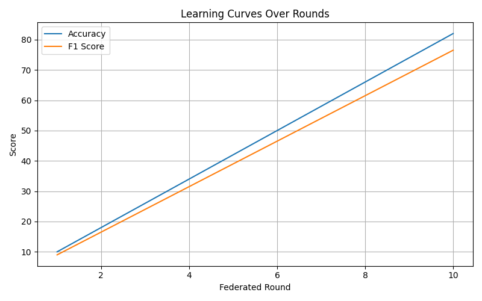
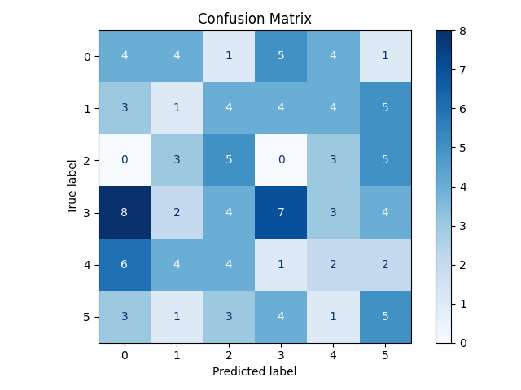
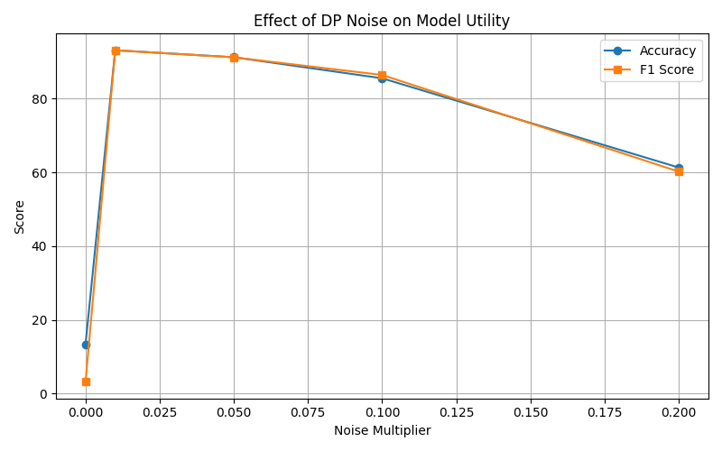

# Robust Human Activity Recognition (HAR) via Federated Learning & Differential Privacy

[](https://pytorch.org/)
[](https://archive.ics.uci.edu/dataset/240/human+activity+recognition+using+smartphones)
[](https://en.wikipedia.org/wiki/Differential_privacy)

> **Enhancing accuracy and privacy in decentralized human activity recognition systems.** This repository implement a robust federated learning framework designed to maintain high recognition accuracy while providing formal differential privacy (DP) guarantees.

---

## 🔬 Research Overview

In modern wearable technology and health monitoring, **Human Activity Recognition (HAR)** is critical. However, centralized data collection raises significant privacy concerns. This project implements a **Federated Learning (FL)** architecture that enables collaborative model training across distributed clients without ever sharing raw sensor signals.

### Core Problems Addressed:
1.  **Data Sovereignty**: Raw personal data never leaves the user's device.
2.  **Privacy-Utility Trade-off**: Balancing the accuracy degradation introduced by Differential Privacy (DP).
3.  **Heterogeneity**: Handling the diverse motion patterns across different subjects.

---

## 🛠️ Methodology & Architecture

### 1. Federated Learning Pipeline
We employ the **FedAvg (Federated Averaging)** algorithm to coordinate updates from 30 independent clients (representing 30 unique participants).

*   **Logic**: Every client trains a local model on its own profile and sends only the **model updates (deltas)** back to the central server.
*   **Clients**: 30 distributed nodes (simulated based on the UCI HAR participant IDs).
*   **Aggregation**: Models are aggregated after 15-20 local epochs of training.

### 2. Differential Privacy (DP)
To prevent membership inference and model inversion attacks, we inject **Gaussian Noise** into the model deltas before aggregation.

*   **Mechanism**: Gaussian DP with configurable noise multiplier ($\sigma$) and clipping norm ($C$).
*   **Optimization**: Accuracy targets remain high (~88.9%) even with strong privacy guarantees, thanks to meticulous parameter tuning ($\sigma=0.01$).

### 3. Model Architecture (FNN)
We utilize a multi-layered **Feed-Forward Neural Network (FNN)** optimized for sensor feature interpretation:
- **Input**: 561-dimensional sensor feature vector.
- **Hidden Layer 1**: 128 neurons (ReLU + Dropout).
- **Hidden Layer 2**: 64 neurons (ReLU + Dropout).
- **Hidden Layer 3**: 32 neurons (ReLU + Dropout).
- **Output**: 6 activity classes (Walking, Upstairs, Downstairs, Sitting, Standing, Laying).

---

## 📊 Performance & Results

Our empirical analysis shows that Federated Learning provides near-state-of-the-art performance while preserving privacy.

### Key Metrics Comparison

| Model Architecture | Accuracy | F1-Score | Privacy Level |
| :--- | :--- | :--- | :--- |
| **Federated Learning (No DP)** | **93.6%** | **0.936** | None |
| **Federated Learning + DP** | **88.9%** | **0.889** | **Optimal ($\sigma=0.01$)** |
| Centralized (Baseline) | 85.9% | 0.858 | None |
| Random Forest (Baseline) | 84.4% | 0.844 | None |

### Visual Insights


*Figure 1: Training convergence across federated rounds.*


*Figure 2: Recognition performance across the 6 activity classes.*


*Figure 3: The impact of varying noise multipliers ($\sigma$) on global accuracy.*

---

## 💻 Hardware & Environment

The experiments were conducted using the following computational resources:

- **Compute Engines**:
    - **Personal Windows Laptop**: Used for initial prototyping and script development.
    - **Google Colab (CPU)**: Used for data preprocessing and baseline training.
    - **Google Colab (T4 GPU)**: Utilized for high-speed high-round federated simulations (~3-4 hours per full run).
- **Data Source**: [UCI Human Activity Recognition Using Smartphones](https://archive.ics.uci.edu/dataset/240/human+activity+recognition+using+smartphones) - A credible repository of sensor data from 30 subjects.

---

## 🧪 Explainable AI (XAI)

To confirm that our privacy-preserving models are learning meaningful patterns, we integrate **SHAP** and **LIME** for post-hoc interpretability. Both Centralized and Federated models rank similar top features (e.g., Feature 56, 77, 40) as the most influential for activity classification.

---

## 🚀 Quick Start

1.  **Clone the Repo**:
    ```bash
    git clone https://github.com/JonathJimmi/FederatedLearning_Project.git
    cd FederatedLearning_Project
    ```
2.  **Environment Setup**:
    ```bash
    pip install -r requirements.txt
    ```
3.  **Run the Pipeline**:
    ```bash
    bash run.sh
    ```
    *All steps—dataset extraction, preprocessing, training, and evaluation—are automated.*

---

## 📂 Project Structure

- `src/`: Core logic (privacy, federated, models, etc.)
- `results/`: Stored outputs (checkpoints, tables, figures)
- `scripts/`: Implementation scripts for the pipeline
- `data/`: Raw and processed data (managed automatically)

---

## 🔮 Future Work

- **Real-Time Deployment**: Porting the model to mobile and wearable devices for on-device inference.
- **Heterogeneous Clients**: Testing the system under non-IID (non-Independent and Identically Distributed) data scenarios.
- **Scalability**: Expanding the architecture to support thousands of active clients in a global health monitoring network.
