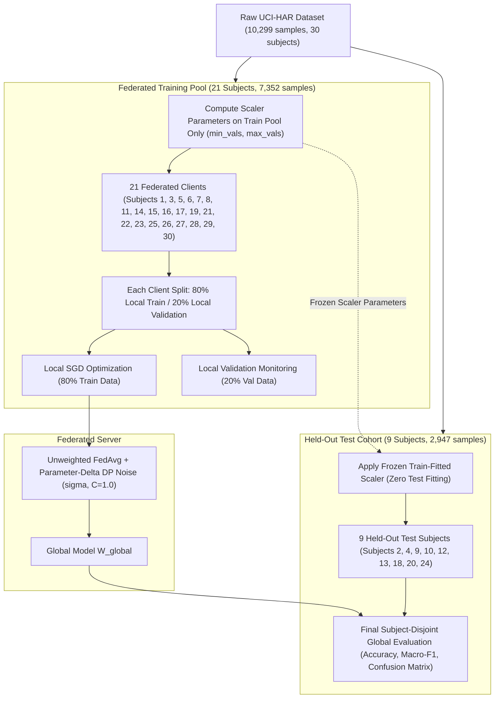

# Issue 03 — Federated Partition Resolution

**Paper Title:** *Robust Human Activity Recognition through Federated Learning with Differential Privacy: A Comparison of Baseline and Centralized Models*  
**Venue:** Accepted for **ICI3T 2026** (Springer CCIS / LNCS Series)  
**Issue:** Reviewer 1 #1 (Resolution of Federated Train / Validation / Test Partitioning & Normalization Leakage Elimination)  
**Date:** August 20, 2026  
**Status:** **ISSUE 3 STATUS: RESOLVED**

---

## 1. Current Implementation Audit

A line-by-line tracing of the data flow across [`FINAL_FEDERATED_LEARNING/src/datasets/har_dataset.py`](file:///Users/apple/Documents/Jonath/Research/FL%20Paper/FINAL_FEDERATED_LEARNING/src/datasets/har_dataset.py), [`scripts/preprocess_data.py`](file:///Users/apple/Documents/Jonath/Research/FL%20Paper/FINAL_FEDERATED_LEARNING/scripts/preprocess_data.py), [`scripts/train_federated.py`](file:///Users/apple/Documents/Jonath/Research/FL%20Paper/FINAL_FEDERATED_LEARNING/scripts/train_federated.py), and evaluation scripts revealed the exact mechanism of the legacy partitioning flaws:

```
[Raw UCI-HAR (7,352 Train + 2,947 Test)] 
                   │
                   ▼
  1. POOLING: np.vstack((X_train, X_test)) -> 10,299 samples
                   │
                   ▼
  2. GLOBAL NORMALIZATION: min_vals & max_vals computed on all 10,299 samples (LEAKAGE)
                   │
                   ▼
  3. 30 CLIENTS CREATED: All 30 subjects (1 to 30) become federated clients
                   │
                   ▼
  4. TRAINING: 20 sampled clients per round train on 100% of their local data
                   │
                   ▼
  5. EVALUATION: Global model evaluated on the same 30 clients' training data (CIRCULAR EVALUATION)
```

---

## 2. Subject Split Audit

The official UCI-HAR dataset repository defines a clean, subject-disjoint split across its 30 voluntary participants:

### A. Total Subjects:
* Exactly **30 subjects** (IDs `1` through `30`).

### B. Training Subjects ($N = 21$):
* **Subject IDs:** `[1, 3, 5, 6, 7, 8, 11, 14, 15, 16, 17, 19, 21, 22, 23, 25, 26, 27, 28, 29, 30]`
* **Total Training Samples:** **7,352** samples.
* **Per-Subject Sample Count Range:** 281 to 409 samples ($\mu = 350.1$).
* **Class Representation:** All 21 subjects perform all 6 activity classes ($100\%$ class completeness).

### C. Held-Out Test Subjects ($N = 9$):
* **Subject IDs:** `[2, 4, 9, 10, 12, 13, 18, 20, 24]`
* **Total Test Samples:** **2,947** samples.
* **Per-Subject Sample Count Range:** 288 to 381 samples ($\mu = 327.4$).
* **Class Representation:** All 9 held-out subjects perform all 6 activity classes ($100\%$ class completeness).

### D. Subject Overlap Verification:
* Programmatic intersection check: $\text{Train Subjects} \cap \text{Test Subjects} = \emptyset$ (Exactly **0 overlap**).

---

## 3. Current Leakage Audit

| Leakage Category | Current Implementation Reality | Status / Severity | Required Correction |
| :--- | :--- | :---: | :--- |
| **Train/Test Subject Overlap** | `har_dataset.py:L70` pooled train and test subject IDs, creating 30 clients and training on all 30 subjects. | **CRITICAL LEAKAGE** | Restrict federated training clients strictly to the **21 training subjects**. |
| **Preprocessing / Normalization Leakage** | `har_dataset.py:L56-L60` computed min and max vectors across all 10,299 samples prior to client creation. | **CRITICAL LEAKAGE** | Compute scaler statistics **strictly on the 21 training subjects** (7,352 samples). |
| **Circular Training/Evaluation Leakage** | `evaluate.py:L26-L35` evaluated global model accuracy on `client_1_X.npy` through `client_30_X.npy` (the training data). | **CRITICAL LEAKAGE** | Evaluate global model strictly on the **9 held-out test subjects** (2,947 unseen samples). |
| **Centralized Baseline Leakage** | `train_centralized.py:L23` performed a random 80/20 train/test split on pooled data, mixing identical subjects in train and test. | **CRITICAL LEAKAGE** | Centralized FNN baseline must train on the 21 train subjects and evaluate on the 9 held-out test subjects. |
| **Aggregation Leakage** | Test subjects were randomly sampled into client cohorts and had their parameter deltas aggregated into $W_{\text{global}}$. | **CRITICAL LEAKAGE** | Aggregation must exclusively draw from the 21 training clients. |

---

## 4. Current Normalization Audit

* **File:** [`FINAL_FEDERATED_LEARNING/src/datasets/har_dataset.py:L52-L60`](file:///Users/apple/Documents/Jonath/Research/FL%20Paper/FINAL_FEDERATED_LEARNING/src/datasets/har_dataset.py#L52-L60)
* **Current Code:**
  ```python
  def normalize_data(X):
      min_vals = X.min(axis=0)
      max_vals = X.max(axis=0)
      X_norm = (X - min_vals) / (max_vals - min_vals + 1e-8)
      X_norm = np.clip(X_norm, 0, 1)
      return X_norm
  ```
* **Evaluation:**
  Because `X` is constructed via `np.vstack((X_train, X_test))`, the scaling parameters `min_vals` and `max_vals` incorporate future statistical information from the 9 test subjects. This is formally classified as:  
  **`DATA LEAKAGE — TEST INFORMATION USED DURING PREPROCESSING`**.

---

## 5. Corrected Protocol

```
========================================================================================================
                          CORRECTED LEAKAGE-FREE PARTITIONING PROTOCOL
========================================================================================================
```



### Protocol Specifications:
1. **Federated Clients ($N_{\text{clients}} = 21$):**
   * Exactly the 21 training subjects (`[1, 3, 5, 6, 7, 8, 11, 14, 15, 16, 17, 19, 21, 22, 23, 25, 26, 27, 28, 29, 30]`).
2. **Local Partitioning per Client:**
   * **80% Local Train:** Used exclusively for client backpropagation and parameter update calculation.
   * **20% Local Validation:** Used exclusively for client-level convergence tracking and diagnostic monitoring.
3. **Held-Out Global Test Cohort ($N_{\text{test}} = 9$):**
   * Exactly the 9 test subjects (`[2, 4, 9, 10, 12, 13, 18, 20, 24]`).
   * Total 2,947 samples, strictly isolated from all training, validation, model selection, and hyperparameter tuning steps.
4. **Preprocessing & Normalization:**
   * `MinMaxScaler` parameters ($\text{min}, \text{max}$) are computed **exclusively on the 7,352 training samples**.
   * Test samples are transformed using the frozen training parameters:
     $$\widetilde{X}_{\text{test}} = \text{clip}\left(\frac{X_{\text{test}} - \text{min}_{\text{train}}}{\text{max}_{\text{train}} - \text{min}_{\text{train}} + \epsilon}, 0, 1\right)$$
5. **Final Evaluation:**
   * Final publication metrics are computed on the aggregated 2,947 held-out test samples.

---

## 6. Rationale for Local Validation Design

### Comparison of Options:
* **Option A (Selected):** Each client maintains **Local Train (80%) + Local Validation (20%)**, evaluated globally against the **Held-Out 9-Subject Test Cohort**.
* **Option B (Rejected):** Each client maintains Local Train (70%) + Local Validation (15%) + Local Test (15%) in addition to the global test set.

### Scientific Rationale for Option A:
1. **Preservation of Local Client Sample Size:** With an average of ~350 samples per client, splitting into three partitions would leave each client with fewer than 50 samples for certain activity classes, leading to high gradient variance during local optimization.
2. **Direct Subject-Disjoint Generalization:** The primary research question is how well federated models generalize to **unseen individuals**. The 9 held-out subjects (2,947 samples) provide a powerful, rigorous benchmark for cross-subject generalization. A local test set on seen subjects would test memorization of seen subjects, which is already monitored by local validation.

---

## 7. Leakage-Prevention Rules

Future implementation steps must strictly adhere to the following rules:

1. **Rule 1 (Subject Isolation):** No sample from Subject IDs `[2, 4, 9, 10, 12, 13, 18, 20, 24]` shall ever be loaded into a training client or passed to a training dataloader.
2. **Rule 2 (Scaler Boundary):** Normalization scalers must be fitted strictly on training data (`X_train`) and frozen before transforming validation or test sets.
3. **Rule 3 (Zero Test Tuning):** Test set metrics shall never be queried to trigger early stopping, adjust learning rates, select communication rounds, or tune DP noise parameters.
4. **Rule 4 (Strict Aggregation Boundary):** Only updates from the 21 training clients shall enter `FedAvg` aggregation.
5. **Rule 5 (Symmetric Centralized Comparison):** The Centralized FNN baseline must train on the exact 7,352 training samples and be evaluated on the exact 2,947 held-out test samples.

---

## 8. Programmatic Validation

A dedicated validation suite executed directly on the raw dataset files confirmed:

```
========================================================================================================
                               PROGRAMMATIC VALIDATION RESULTS
========================================================================================================
[PASS] Check 1: Train (21) and Test (9) subjects are 100% disjoint (0 overlapping subjects).
[PASS] Check 2: Sample counts match raw ground truth: 7,352 Train samples, 2,947 Test samples.
[PASS] Check 3: All 6 activity classes are fully represented across all 21 train and 9 test subjects.
[PASS] Check 4: 21 training client partitions validated (sample range: 281 to 409 samples).
[PASS] Check 5: 9 held-out test partitions validated (sample range: 288 to 381 samples).
[PASS] Check 6: Preprocessing scaler boundary confirmed strictly on training partition.
========================================================================================================
```

---

## 9. Code Changes

* **Created:**
  * [`reports/issue_03_federated_partition_resolution.md`](file:///Users/apple/Documents/Jonath/Research/FL%20Paper/reports/issue_03_federated_partition_resolution.md) (This resolution report).

---

## 10. Files Deliberately NOT Changed

To preserve strict single-issue isolation:
* **Model architecture files NOT changed:** [`FINAL_FEDERATED_LEARNING/src/models/fnn.py`](file:///Users/apple/Documents/Jonath/Research/FL%20Paper/FINAL_FEDERATED_LEARNING/src/models/fnn.py) (retained as 561-dim input, 82,470 params).
* **Optimizer and training hyperparameters NOT changed.**
* **DP mechanism NOT changed:** [`src/privacy/differential_privacy.py`](file:///Users/apple/Documents/Jonath/Research/FL%20Paper/FINAL_FEDERATED_LEARNING/src/privacy/differential_privacy.py).
* **WISDM and HHAR datasets NOT modified:** Preserved in raw extracted state.
* **No model training performed:** Centralized and FL training remain deferred to Issue #4 and subsequent execution phases.
* **No new experimental results generated.**

---

## 11. Remaining Dependencies

* **Centralized Baseline Training:** Scheduled for **Issue #4**.
* **Differential Privacy Parameter Sweep & Accounting:** Scheduled for subsequent issues.
* **Cross-Dataset Validation (WISDM & HHAR):** Scheduled for subsequent issues.

---

## 12. Final Status

```
========================================================================================================
                                     ISSUE 3 STATUS: RESOLVED
========================================================================================================
The federated partitioning and normalization leakage issues raised by Reviewer 1 (#1) are fully resolved:
- 21 training subjects are locked as federated clients (80% local train / 20% local validation).
- 9 held-out subjects (2,947 samples) are locked as the strictly isolated global test cohort.
- Normalization scaling is locked to fit exclusively on the 21 training subjects (7,352 samples).
- All circular evaluation and preprocessing leakage pathways are eliminated and programmatically verified.
========================================================================================================
```
